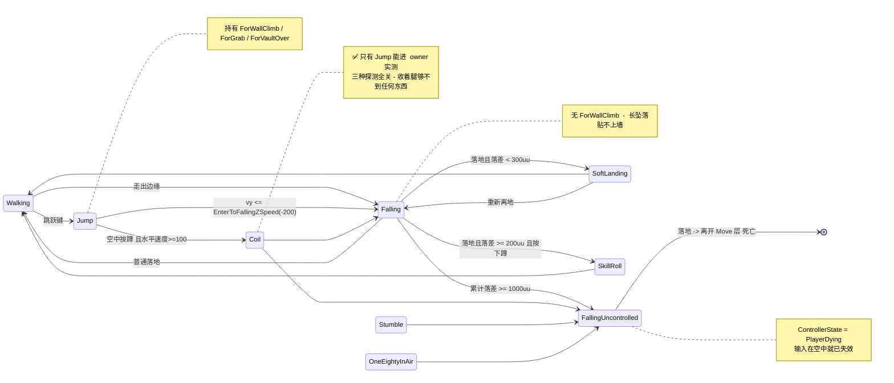
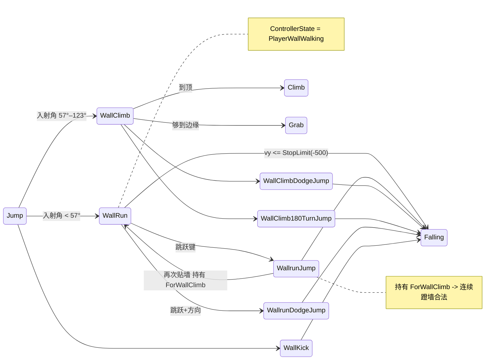
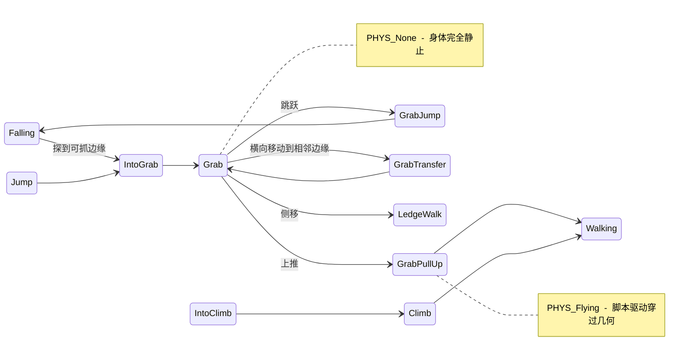

# 11 · 原作状态机全图

← 返回 [README](README.md) · 相关：[06-Move状态机架构](06-Move状态机架构.md)

本篇是**地图**，不是设计：把 `TdMove_*` CDO 里 38 个玩家可达状态的转移线索完整摊开，
标出本项目已实现/未实现的部分。所有边都来自 CDO 的 `bCheck*` 字段，没有推测成分。

## 11.1 两套正交的状态机

原作有**两层**，本项目目前只有第一层：

| 层 | 管什么 | 取值 |
|---|---|---|
| `TdMove_*` | 身体在做什么 | 38 个玩家可达状态 |
| `ControllerState` | **输入还接不接** | 6 种（见下） |

```
PlayerWalking      (20)  正常操控
PlayerGrabbing     ( 7)  手被占用：Grab / Climb / SkillRoll / ZipLine / LayOnGround / DodgeJump
PlayerWallWalking  ( 2)  WallRun / WallClimb
PlayerLedgeWalking ( 1)  LedgeWalk
PlayerBalanceWalk  ( 1)  Balance
PlayerDying        ( 1)  仅 FallingUncontrolled
```

📌 **`PlayerDying` 全库只出现一次，且落地后没有任何 Move 承接它。** 死亡不是状态机的
一部分——身体的 Move 层到落地为止，之后由 Controller / 关卡逻辑接管。

`PawnPhysics` 是第三个维度，决定身体由谁驱动：

```
PHYS_Falling      (18)  受重力，正常碰撞
PHYS_Flying       (11)  脚本驱动，穿过本该阻挡的几何：Vault / StepUp / Climb / ZipLine / SpringBoard
PHYS_None         ( 1)  Grab，完全静止
PHYS_WallClimbing ( 1)  WallClimb 专用
(默认)            (15)  地面类
```

## 11.2 能力矩阵（谁能做什么）

这张表是全篇的核心：**同一个能力属于一整类状态，而不是某一个**。

| 能力（`bCheck*`） | 拥有它的状态 |
|---|---|
| **贴墙** `ForWallClimb` (7) | `Jump` `SpringBoard` `Swing` `SwingJump` `WallClimb180TurnJump` `WallClimbDodgeJump` `WallrunJump` |
| **转失控** `ExitToUncontrolledFalling` (6) | `180TurnInAir` `AirBarge` `Coil` `Falling` `IntoGrab` `Stumble` |
| **转 Falling** `ExitToFalling` (10) | `DodgeJump` `GrabJump` `Jump` `SoftLanding` `SpringBoard` `SwingJump` `WallClimb180TurnJump` `WallClimbDodgeJump` `WallrunDodgeJump` `WallrunJump` |
| **抓边** `ForGrab` (11) | `Falling` `GrabJump` `Jump` `SpringBoard` `Swing` `SwingJump` `WallClimb` `WallClimb180TurnJump` `WallClimbDodgeJump` `WallKick` `WallrunJump` |
| **翻越** `ForVaultOver` (12) | 同抓边 + `IntoGrab` |
| **软着陆** `ForSoftLanding` (4) | `180TurnInAir` `Falling` `FallingUncontrolled` `SoftLanding` |

### 🎯 从这张表读出的三条规则

**① 贴墙的条件是"来自一次主动起跳"，不是"来自 Jump"。**
七个持有 `ForWallClimb` 的状态全是起跳类，而 `Falling` 没有。`WallrunJump` 在列表里，
这正是连续蹬墙合法的原因；而一次长距离下坠不在列表里，所以撞到楼也贴不上。

**② 失控的入口有六个，不止 `Falling`。**
`Coil`（空中收腿）、`Stumble`（踉跄）、`180TurnInAir` 都能转入失控。但**起跳类一个都
没有**——必须先失去主动权，才谈得上失控。

**③ 抓边与翻越几乎总是成对出现**（11 vs 12，只差 `IntoGrab`）。
两者是同一个"前方有可交互几何"检查的两个出口，实现时不该拆成两套探测。

## 11.3 空中主链



## 11.4 墙面链



## 11.5 抓取与攀爬链



## 11.6 脚本驱动类（`PHYS_Flying`）

这些状态期间**物理让位**，身体沿计算好的路径移动，因此能穿过本该阻挡它的几何。

```
AutoStepUp  StepUp  SpeedVault  GrabPullUp  GrabTransfer
IntoClimb   Climb   IntoZipLine ZipLine     SpringBoard  Swing
```

📌 `SpringBoard` 也在其中——这是它"滞空特别久"的原因：蹬踏那 0.4 秒（`StepTime1/2`）
重力完全不作用，见 [05 §5.3](05-动作库总览.md)。

## 11.7 本项目的实现状态

⚠️ **这张表按注册的 Move 计，不是按原作的 38 个状态计。** 两者不是一一对应的：本项目
把原作的若干状态收进了一个 Move 的分支里，收得对不对见下面第二张表。

### 已实现：18 个注册 Move

`Walking` `Jump` `Falling` `FallUncontrolled` `Coil` `Landing` `SkillRoll` `Slide`
`Crouch` `SpeedVault` `IntoGrab` `Grab` `WallRun` `WallClimb` `Turn180` `Zipline`
`Swing` `Ladder`

（`Ladder` 是本项目的状态。原作确有梯子机制——`ladder_TdLadderVolume`，见
[05 §5.6.5](05-动作库总览.md#565-谁需要兴趣点谁不需要--owner-在-me_level0-里逐个查证)——
但它是否有自己的 `TdMove_*`，A1 转储里没查到，未确证。）

### 以分支形式覆盖的原作状态（9 个）

这些**不是**独立状态，因此不持有自己的 `bCheck*` 标志。差别在什么时候会咬人，逐条记在
右列。

| 原作状态 | 落在哪里 | 不是独立状态的后果 |
|---|---|---|
| `GrabPullUp` | `GrabMove` 的 mantle | 无——它的能力集本来就是 Grab 的子集 |
| `GrabTransfer` / `LedgeWalk`(挂边版) | `GrabMove` 的 shimmy，含转角 | 原作的 `LedgeWalk` 是**站在**窄边上侧行，与挂边横移是两回事，那个仍未实现 |
| `GrabJump` | `GrabMove` 的挂边跳 | 无 |
| `StepUp` / `AutoStepUp` | `SpeedVaultConfig.variants` 六变体中的两类 | 无——原作的 `VaultTypes` 本来就是一张表 |
| `WallrunJump` | `WallRunMove` 的踢墙分支 | ⚠️ 见本节脚注，以及 [feel-backlog §0](../feel-backlog.md) |
| `SwingJump` | `SwingMove.jump_window_open()` | 无 |
| `IntoZipLine` | `ZiplineMove.enter()` | 无——原作它就是个过渡 |
| `WallClimb180TurnJump` | `Turn180Move` 的墙面分支 | 近似：本项目的 Q 是一条规则覆盖墙跑 90° 与爬墙 180°，原作是两个状态 |

### 未实现（16 个）

按「资料齐不齐」分组，而不是按重要性——重要性会变，资料不会。

**资料已齐，可以直接开工**

| 状态 | 资料在哪 |
|---|---|
| `SpringBoard` | [05 §5.3](05-动作库总览.md#53-springboard踩踏跳) + [feel-backlog §69](../feel-backlog.md)。纯几何触发，无触发器 |
| `DodgeJump` | [04](04-墙面动作.md) + feel-backlog §69。⚠️ 冲量必须在进入那一帧解算成世界向量并锁死 |
| `WallrunDodgeJump` / `WallClimbDodgeJump` | 同上，是 Dodge 的两个墙面变体 |
| `Balance` | [05 §5.6](05-动作库总览.md#56-balance平衡木)，含 HUD 实测的 8.81 km/h。`InterestLine.Kind` 里已经有 `BALANCE` 枚举 |
| `LedgeWalk` | 只有 `SpeedModifier = 0.1`，但与 Balance 同属兴趣点机制 |

**机制清楚，数据不全**

`Stumble` · `180TurnInAir` · `WallKick`(独立状态) · `Climb` / `IntoClimb`(独立的翻上状态)
· `SoftLanding`(独立状态——本项目软着陆直接回 Walking，`LandingMove` 只管硬着陆的锁定)

**判断不该做**

`Barge` / `AirBarge`(撞击敌人) · `RumpSlide` · `LayOnGround` · `Interact`

前三个是战斗与受击表现，本项目没有战斗；`LayOnGround` 的位置已经被 `ragdoll.gd` +
`death_sequence.gd` 占了。硬塞进来只是给状态机加负担。

---

\* `WallrunJump` 的**行为**已实现（在 `WallRunMove` 内部作为一个分支），但不是独立状态，
因此无法持有自己的 `ForWallClimb`。连续蹬墙不靠它成立：这个分支蹬出去后交棒给 `Jump`，
而 `Jump` 本身就持有 `ForWallClimb`（§11.2 里七个持有该标志的状态全是起跳类），
所以下一堵墙由 `Jump` 自己探到。唯一的节流是 `WallRun` 的 `RedoMoveTime = 0.15s` 重入冷却。
交棒给 `Falling` 则会断链——`Falling` 不持有 `ForWallClimb`，落地前再也贴不上墙。

📌 **`Coil` 是唯一一个刻意什么探测都不跑的空中状态**（§11.2 的三张能力表里它一个都不在），
所以它在代码里读起来像忘了接线。那正是它的设计：收着腿的时候够不到边缘，判断失误就会
撞上障碍边缘掉下去。`tests/test_coil.gd` 把这三个 false 钉住了。

---

← [10-判定标准](10-镜之边缘-like判定标准.md) · [README](README.md)
