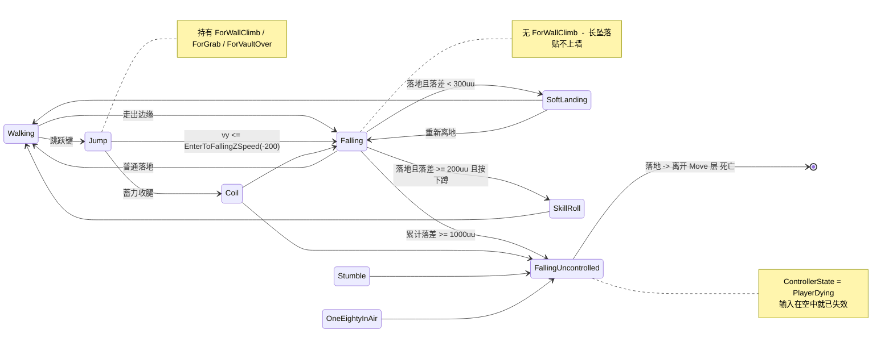
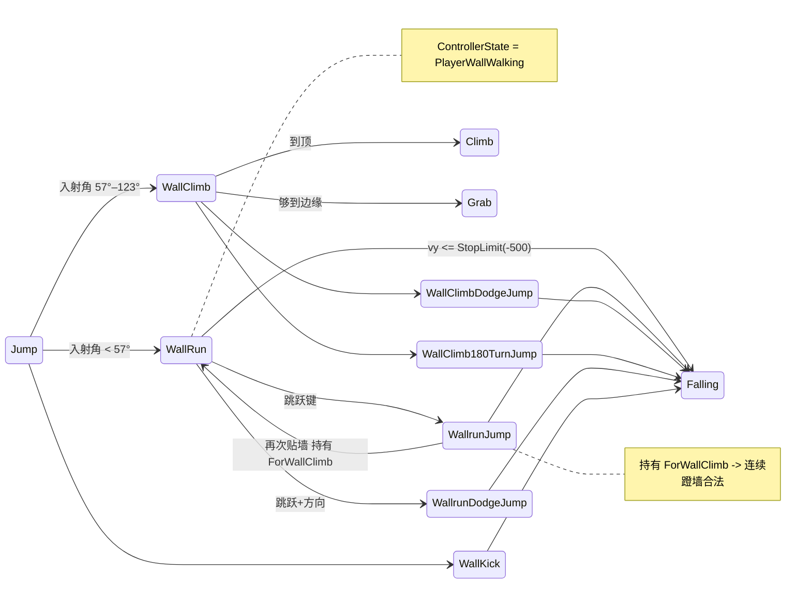
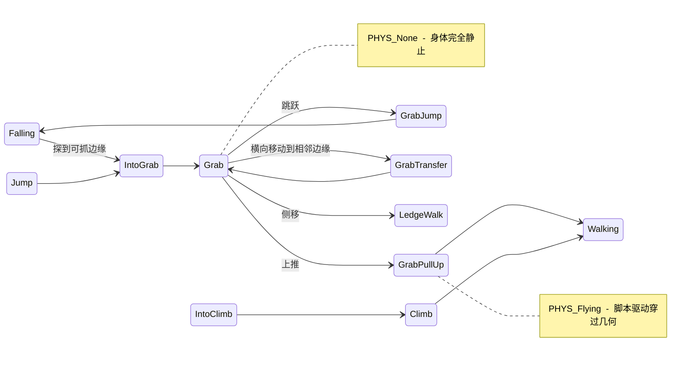

# 11 · 原作状态机全图

← 返回 [README](README.md) · 相关：[06-Move状态机架构](06-Move状态机架构.md)

本篇是**地图**，不是设计：把 `TdMove_*` CDO 里 38 个玩家可达状态的转移线索完整摊开，
标出本项目已实现/未实现的部分。所有边都来自 CDO 的 `bCheck*` 字段，没有推测成分。

## 11.1 两套正交的状态机

原作有**两层**，本项目目前只有第一层：

| 层 | 管什么 | 取值 |
|---|---|---|
| `TdMove_*` | 身体在做什么 | 38 个玩家可达状态 |
| `ControllerState` | **输入还接不接** | 6 种（见下） |

```
PlayerWalking      (20)  正常操控
PlayerGrabbing     ( 7)  手被占用：Grab / Climb / SkillRoll / ZipLine / LayOnGround / DodgeJump
PlayerWallWalking  ( 2)  WallRun / WallClimb
PlayerLedgeWalking ( 1)  LedgeWalk
PlayerBalanceWalk  ( 1)  Balance
PlayerDying        ( 1)  仅 FallingUncontrolled
```

📌 **`PlayerDying` 全库只出现一次，且落地后没有任何 Move 承接它。** 死亡不是状态机的
一部分——身体的 Move 层到落地为止，之后由 Controller / 关卡逻辑接管。

`PawnPhysics` 是第三个维度，决定身体由谁驱动：

```
PHYS_Falling      (18)  受重力，正常碰撞
PHYS_Flying       (11)  脚本驱动，穿过本该阻挡的几何：Vault / StepUp / Climb / ZipLine / SpringBoard
PHYS_None         ( 1)  Grab，完全静止
PHYS_WallClimbing ( 1)  WallClimb 专用
(默认)            (15)  地面类
```

## 11.2 能力矩阵（谁能做什么）

这张表是全篇的核心：**同一个能力属于一整类状态，而不是某一个**。

| 能力（`bCheck*`） | 拥有它的状态 |
|---|---|
| **贴墙** `ForWallClimb` (7) | `Jump` `SpringBoard` `Swing` `SwingJump` `WallClimb180TurnJump` `WallClimbDodgeJump` `WallrunJump` |
| **转失控** `ExitToUncontrolledFalling` (6) | `180TurnInAir` `AirBarge` `Coil` `Falling` `IntoGrab` `Stumble` |
| **转 Falling** `ExitToFalling` (10) | `DodgeJump` `GrabJump` `Jump` `SoftLanding` `SpringBoard` `SwingJump` `WallClimb180TurnJump` `WallClimbDodgeJump` `WallrunDodgeJump` `WallrunJump` |
| **抓边** `ForGrab` (11) | `Falling` `GrabJump` `Jump` `SpringBoard` `Swing` `SwingJump` `WallClimb` `WallClimb180TurnJump` `WallClimbDodgeJump` `WallKick` `WallrunJump` |
| **翻越** `ForVaultOver` (12) | 同抓边 + `IntoGrab` |
| **软着陆** `ForSoftLanding` (4) | `180TurnInAir` `Falling` `FallingUncontrolled` `SoftLanding` |

### 🎯 从这张表读出的三条规则

**① 贴墙的条件是"来自一次主动起跳"，不是"来自 Jump"。**
七个持有 `ForWallClimb` 的状态全是起跳类，而 `Falling` 没有。`WallrunJump` 在列表里，
这正是连续蹬墙合法的原因；而一次长距离下坠不在列表里，所以撞到楼也贴不上。

**② 失控的入口有六个，不止 `Falling`。**
`Coil`（空中收腿）、`Stumble`（踉跄）、`180TurnInAir` 都能转入失控。但**起跳类一个都
没有**——必须先失去主动权，才谈得上失控。

**③ 抓边与翻越几乎总是成对出现**（11 vs 12，只差 `IntoGrab`）。
两者是同一个"前方有可交互几何"检查的两个出口，实现时不该拆成两套探测。

## 11.3 空中主链



## 11.4 墙面链



## 11.5 抓取与攀爬链



## 11.6 脚本驱动类（`PHYS_Flying`）

这些状态期间**物理让位**，身体沿计算好的路径移动，因此能穿过本该阻挡它的几何。

```
AutoStepUp  StepUp  SpeedVault  GrabPullUp  GrabTransfer
IntoClimb   Climb   IntoZipLine ZipLine     SpringBoard  Swing
```

📌 `SpringBoard` 也在其中——这是它"滞空特别久"的原因：蹬踏那 0.4 秒（`StepTime1/2`）
重力完全不作用，见 [05 §5.3](05-动作库总览.md)。

## 11.7 本项目的实现状态

| 已实现 (10) | 未实现 (29) |
|---|---|
| `Walking` `Falling` `FallingUncontrolled` `Jump` `Landing` `Slide` `Crouch` `SpeedVault` `Grab` `WallRun` | `SoftLanding` `SkillRoll` `Coil` `Stumble` `180Turn` `180TurnInAir` `Balance` `LedgeWalk` `Climb` `IntoClimb` `IntoGrab` `GrabJump` `GrabPullUp` `GrabTransfer` `WallClimb` `WallKick` `WallrunJump`* `WallrunDodgeJump` `WallClimbDodgeJump` `WallClimb180TurnJump` `DodgeJump` `SpringBoard` `Swing` `SwingJump` `ZipLine` `IntoZipLine` `StepUp` `AutoStepUp` `RumpSlide` `LayOnGround` `Interact` |

\* `WallrunJump` 的**行为**已实现（在 `WallRunMove` 内部作为一个分支），但不是独立状态，
因此无法持有自己的 `ForWallClimb` —— 连续蹬墙目前靠别的机制成立。

---

← [10-判定标准](10-镜之边缘-like判定标准.md) · [README](README.md)
