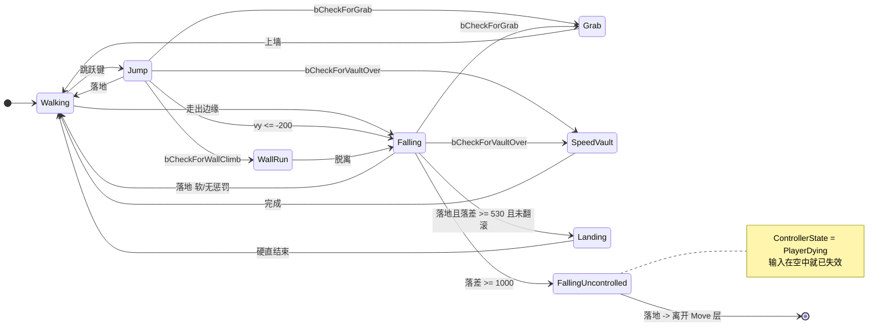
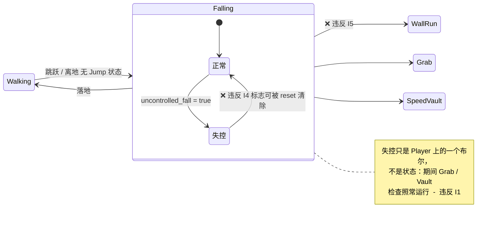

# 空中状态链设计：Jump / FallingUncontrolled / Landing

> 目标：按 `TdMove_*` CDO **1:1** 还原原作的空中状态划分，让"哪些流转不存在"
> 由状态归属表达，而不是散落在各处的 if。

## 1. 原作的状态与检查项（照抄 CDO，未经解释）

| 状态 | ControllerState | 允许的检查 | 视角钳制 |
|---|---|---|---|
| `Jump` | PlayerWalking | Grab · VaultOver · **WallClimb** | — |
| `Falling` | PlayerWalking | Grab · VaultOver · **ExitToUncontrolled** · SoftLanding | — |
| `FallingUncontrolled` | **PlayerDying** | **仅 SoftLanding** | — |
| `SoftLanding` | PlayerWalking | ExitToFalling · SoftLanding | yaw ±90° · pitch ±27.5° |
| `SkillRoll` | PlayerGrabbing | — | pitch −11°…180° · yaw ±27.5° |

### ⚠️ 两套正交的状态机，不要混为一谈

`TdMove_*` 管**身体在做什么**；`ControllerState` 管**输入还接不接**。全库
`ControllerState` 只有六种取值，其中 **`PlayerDying` 只出现一次**——即
`TdMove_FallingUncontrolled` 自己。

**落地之后没有任何 Move 承接死亡。** 身体的 Move 层到落地为止，之后是 Controller /
关卡逻辑接管（演出、重生）。因此**死亡不是状态机的一部分**，本设计不得为它新建 Move。

（`TdMove_LayOnGround` 的 ControllerState 是 `PlayerGrabbing`，且带
`FrictionModifier = 0.15` 与视角钳制——那是**被击倒**用的，与摔死无关。）

分界常量：

```
EnterToFallingZSpeed        = -200 uu/s   Jump → Falling
FallingUncontrolledHeight   = 1000 uu     Falling → FallingUncontrolled
HardLandingHeight           = 530 uu      落地是否硬着陆
SkillRollLandingHeight      = 200 uu      落地是否允许翻滚
```

## 2. 目标状态图



## 3. 不变量（这些是本设计的实质，应当成为测试）

以下每一条都描述**不存在的边**。状态机的意义在此，不在于名字好看。

| # | 不变量 | 依据 |
|---|---|---|
| **I1** | `FallingUncontrolled` 期间不接受任何检查（抓边/翻越/墙跑全部关闭），唯一出口是落地 | CDO 仅有 `bCheckForSoftLanding`，无 Grab/Vault |
| **I2** | 不存在**起跳类 → FallingUncontrolled** | 6 个持有 `bCheckExitToUncontrolledFalling` 的状态里没有任何起跳类；必须先失去主动权 |
| **I3** | 不存在 `Falling → Jump` | 单行线：速度掉破阈值不可逆 |
| **I4** | 不存在 `FallingUncontrolled → Falling` | 同上，且 ControllerState 已是 PlayerDying |
| **I5** | 空中进入 `WallRun` 只能来自**主动起跳类**状态 | 7 个持有 `bCheckForWallClimb` 的状态全是起跳类；`Falling` 不在其中（见 [11 §11.2](../../mirrors-edge-deep-research/11-状态机全图.md)） |
| **I6** | 死亡**不产生新 Move**；`FallingUncontrolled` 落地即离开 Move 层 | `PlayerDying` 全库仅此一处，落地后无 Move 承接 |
| **I7** | `Landing` 期间不接受任何移动/转向输入 | 硬直的定义；时长 ✅ 实测 **2.00 s** |

### I2 的意义（容易写错的一条）

即使玩家在**上升段**就已累计下落超过 10 m（连续蹬墙下坠可以做到），也**不会**直接失控——
必须先因速度转入 `Falling`，才可能被判失控。这条边的缺席是原作明确的设计，不是疏漏。

## 4. 当前实现的偏差



三处偏差：

1. **无 `Jump` 状态** → I5 无法表达，只能用速度守卫近似（已临时加，待删）
2. **失控是布尔而非状态** → I1、I4 无法保证，失控中仍可抓边/翻越
3. **无 `Landing`，也无任何死亡表现** → 摔死时落地即重生，玩家看不到发生了什么

## 5. 本轮范围

做 **3 个** Move：`Jump` · `FallingUncontrolled` · `Landing`。

死亡演出**不是 Move**（见 §1 的正交说明）：`FallingUncontrolled` 落地时发信号，
由 `Arena` 播放演出并重生。这与既有的 `died_from_fall` 接线一致，无需新状态。

**押后**：`SoftLanding` · `SkillRoll`（现为布尔 `rolled`）。它们要改动现有翻滚判定，
与本轮混在一起会让 review 失焦。

## 6. 视觉效果层

`ScreenEffects`（`CameraRig` 下的 `CanvasLayer > ColorRect` + shader），对外仅三个量：

```gdscript
set_tint(color, amount)     # Landing 红屏
set_desaturation(amount)    # FallingUncontrolled 渐进 / 死亡演出全量
set_blur(amount)            # FallingUncontrolled 随下落速度
```

不含时间逻辑：淡入淡出由各状态自己插值。效果层不知道状态机存在。

### 时间轴

**Landing 的 2.00 s 是 ✅ 实测**（6 次硬着陆，落差均 7.08 m）：测量取
`Falling` 结束帧到 `Walking` 起始帧，六次读数 2.03 / 2.00 / 2.00 / 2.00 / 2.00 / 2.02。

> 📌 方法note：不要去测 `Landing` 状态本身的跨度——状态名会被识别成 `kanding` /
> `Ganding?`，中途的失败帧把一段硬直切成数截，测出来是 0.42–1.97 s 的垃圾。
> 端点测量只依赖两个边界帧，中间读成什么都无关，因此能给出 ±0.03 s 的一致性。

死亡演出的时间轴仍为 ⚠️ 项目自定（原作那段是过场，未测），且它属于 `Arena`／呈现层，
不属于状态机。

```
Landing   0.00s        相机降至蹲伏高度 + 强制下俯，红屏峰值
          0.00→2.00s   高度与俯角回升，红屏淡出
          2.00s        → Walking

死亡演出（Arena 驱动，非 Move）
          0.00→0.35s   相机从眼高落至半蹲（ease-out）
          0.35→0.70s   停顿
          0.70→1.40s   以脚底为圆心左划 1/4 圆，roll → −90°
          1.40s        → 重生
```

`FallingUncontrolled` 的去色/模糊按**下落速度**映射，而非时间：从 10 m 边缘勉强越线
与从 40 m 摔落，观感应当不同。
